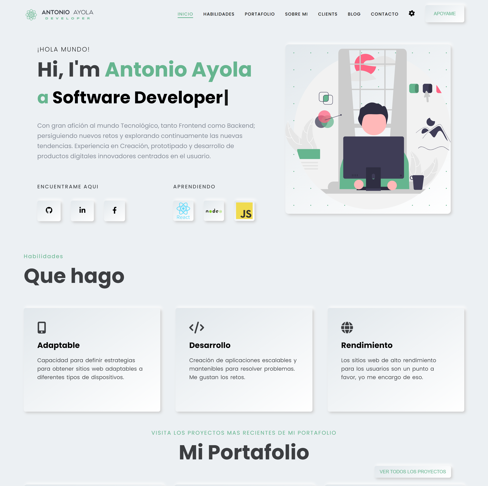
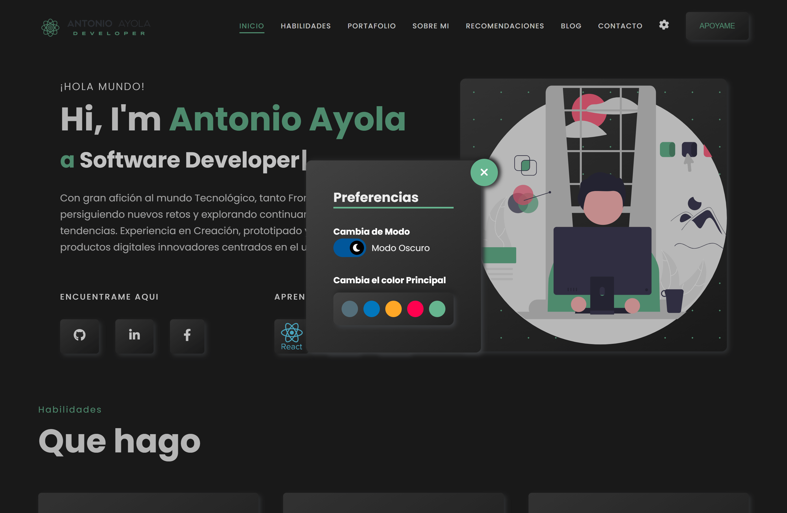

# **ANTONIO AYOLA PORTAFOLIO**

Este proyecto es mi portafolio profesional donde muestro mis skills, que experiencia tengo y en que me estoy especializando.

Este portafolio es una PWA, asi que puedes instalar la aplicacion en tu dispositivo.

## **CAPTURAS**

## **DEMO**

Puede ver el demo de este haciendo click [aquí](https://antonioayola.netlify.app/).

## **TECNOLOGIAS**

Para el portafolio utilice las siguientes tecnologias:

- ReactJS
- Modules CSS
- Netlify
- PWA

## **USO**

Para usar este proyecto:

- Clonar repositorio: ` git clone https://github.com/Tono2007/portafolio.git`
- Instalar dependencias: `npm install` o` yarn install`
- Ejecutarlo: `npm start` o ` yarn start`
